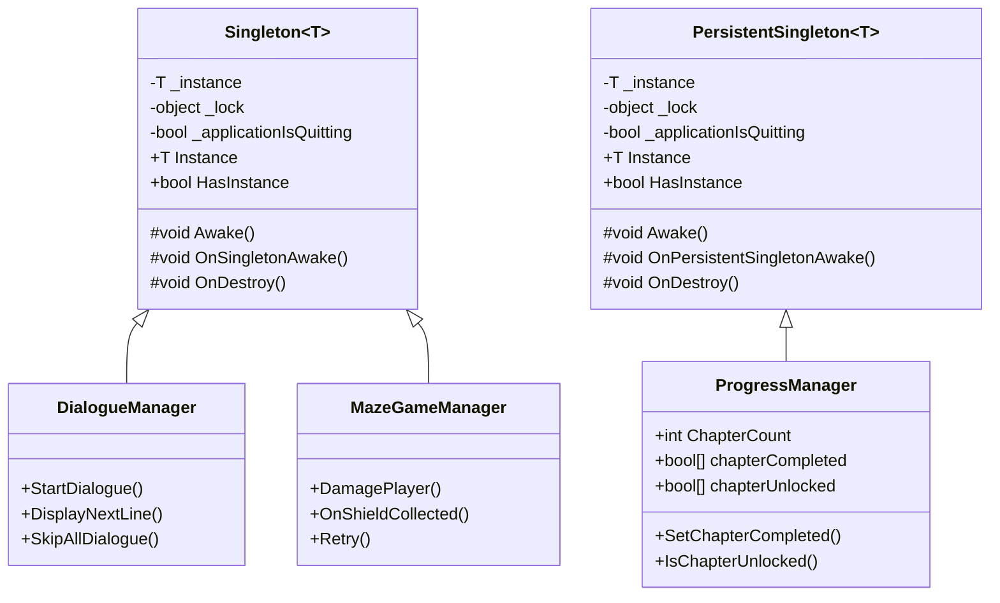
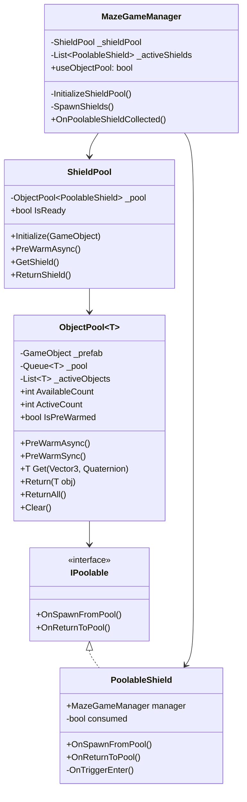
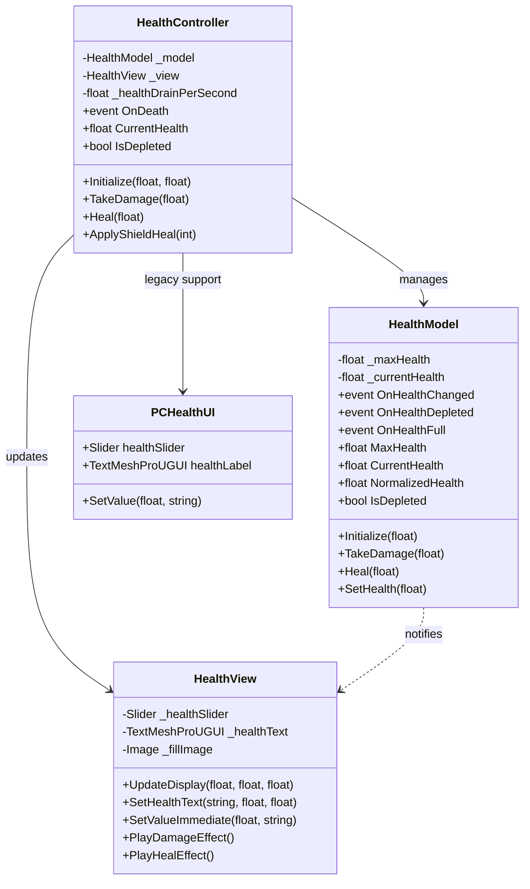
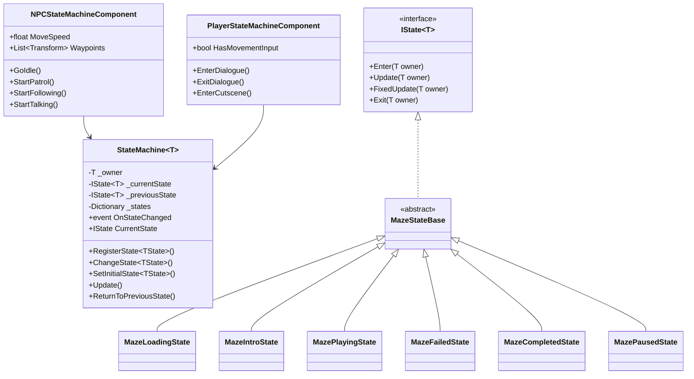
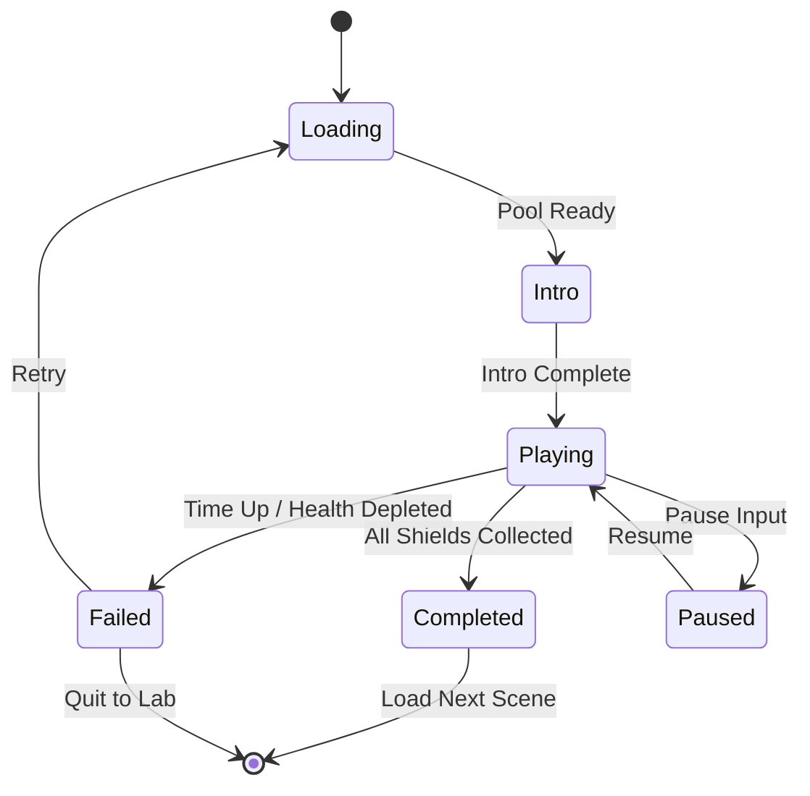
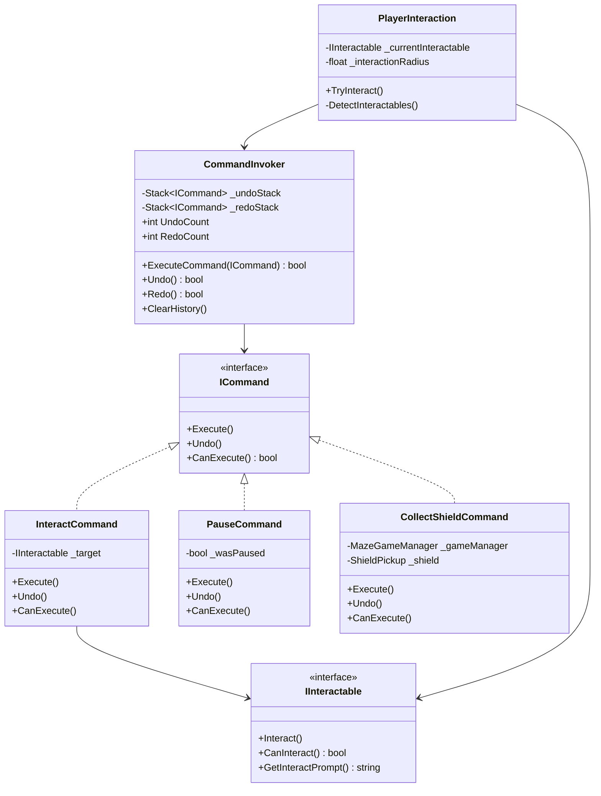

# Design Patterns Documentation for CyberSafe

This document provides comprehensive documentation for the design patterns implemented in the CyberSafe Unity project. Each pattern is explained in layman's terms, with specific applications in CyberSafe, UML diagrams, implementation details, and testing guidelines.

---

## Table of Contents

1. [Singleton Pattern](#1-singleton-pattern)
2. [Object Pool Pattern](#2-object-pool-pattern)
3. [MVC Pattern (Health System)](#3-mvc-pattern-health-system)
4. [State Pattern](#4-state-pattern)
5. [Command Pattern](#5-command-pattern)

---

## 1. Singleton Pattern

### Brief Explanation (Layman's Terms)

The Singleton pattern ensures that a class has only **one instance** throughout the entire game. Think of it like having a single manager or boss in an office - there's only one, and everyone knows how to reach them. This is useful for managers that need to be accessed from anywhere in the game.

**Two Variants:**
- **Singleton**: For scene-specific managers (destroyed when scene changes)
- **PersistentSingleton**: For managers that survive scene loads (like save data)

### Application in CyberSafe

| Class | Pattern | Purpose |
|-------|---------|---------|
| `ProgressManager` | PersistentSingleton | Tracks chapter completion across scenes |
| `DialogueManager` | Singleton | Manages dialogue display in current scene |
| `MazeGameManager` | Singleton | Controls the Malware Maze minigame |

### UML Diagram



### Implementation Steps

1. **Create Base Classes** (`Assets/Scripts/DesignPatterns/Singleton/`)
   ```csharp
   // Singleton.cs - For scene-scoped singletons
   public abstract class Singleton<T> : MonoBehaviour where T : MonoBehaviour
   {
       private static T _instance;
       
       public static T Instance => _instance;
       
       protected virtual void Awake()
       {
           if (_instance != null && _instance != this)
           {
               Destroy(gameObject);
               return;
           }
           _instance = this as T;
           OnSingletonAwake();
       }
       
       protected virtual void OnSingletonAwake() { }
   }
   ```

2. **Inherit from Base Class**
   ```csharp
   // Before
   public class ProgressManager : MonoBehaviour
   {
       public static ProgressManager Instance { get; private set; }
       
       private void Awake()
       {
           if (Instance != null) { Destroy(gameObject); return; }
           Instance = this;
           DontDestroyOnLoad(gameObject);
       }
   }
   
   // After
   public class ProgressManager : PersistentSingleton<ProgressManager>
   {
       protected override void OnPersistentSingletonAwake()
       {
           // Initialization code here
       }
   }
   ```

### Testing & Verification

- Verify only one instance exists by checking `Instance` property
- Test scene transitions to ensure PersistentSingleton survives
- Test duplicate GameObjects are destroyed automatically
- Use `Debug.Log` statements to track singleton lifecycle

---

## 2. Object Pool Pattern

### Brief Explanation (Layman's Terms)

The Object Pool pattern is like a **recycling system** for game objects. Instead of creating and destroying objects (which is slow and creates garbage), we create objects ahead of time and reuse them. Think of it like a pool of rental cars - when you need one, you take it from the pool; when done, you return it for someone else to use.

**Why It's Important:** The Malware Maze was experiencing severe loading lag because shield prefabs (100k+ vertices) were instantiated at runtime. Object pooling fixes this by pre-creating shields during loading.

### Application in CyberSafe

The Object Pool is used in the **Malware Maze** to pre-warm shield prefabs:
- Shields are pre-instantiated during the loading phase
- When spawning, shields are retrieved from the pool (instant)
- When collected, shields return to the pool instead of being destroyed
- **Performance improvement**: Eliminates runtime instantiation lag

### UML Diagram



### Implementation Steps

1. **Create IPoolable Interface**
   ```csharp
   public interface IPoolable
   {
       void OnSpawnFromPool();  // Called when retrieved
       void OnReturnToPool();   // Called when returned
   }
   ```

2. **Create Generic ObjectPool**
   ```csharp
   public class ObjectPool<T> where T : MonoBehaviour, IPoolable
   {
       private Queue<T> _pool = new Queue<T>();
       
       public IEnumerator PreWarmAsync(MonoBehaviour mono, int objectsPerFrame)
       {
           // Create objects over multiple frames to avoid lag
       }
       
       public T Get(Vector3 position, Quaternion rotation)
       {
           T obj = _pool.Count > 0 ? _pool.Dequeue() : CreateNew();
           obj.OnSpawnFromPool();
           return obj;
       }
       
       public void Return(T obj)
       {
           obj.OnReturnToPool();
           obj.gameObject.SetActive(false);
           _pool.Enqueue(obj);
       }
   }
   ```

3. **Create PoolableShield** (implements IPoolable)
   ```csharp
   public class PoolableShield : MonoBehaviour, IPoolable
   {
       public void OnSpawnFromPool() => consumed = false;
       public void OnReturnToPool() => consumed = true;
   }
   ```

4. **Integrate with MazeGameManager**
   ```csharp
   private IEnumerator Start()
   {
       if (useObjectPool)
           yield return InitializeShieldPool();
       SpawnShields();  // Now uses pool
   }
   ```

### Testing & Verification

- Check console for "Shield pool pre-warmed and ready" message
- Monitor frame rate during maze loading (should be smooth)
- Verify shields are reused (check `_shieldPool.AvailableCount`)
- Test backward compatibility with `useObjectPool = false`

---

## 3. MVC Pattern (Health System)

### Brief Explanation (Layman's Terms)

MVC (Model-View-Controller) separates concerns into three parts:
- **Model**: The data (what the health value is)
- **View**: The display (what the player sees - health bar, text)
- **Controller**: The logic (what happens when health changes)

Think of it like a restaurant: the kitchen (Model) prepares food, the waiter (Controller) manages orders and delivery, and the table presentation (View) is what customers see.

### Application in CyberSafe

The MVC Health System manages PC health in the Malware Maze:
- **HealthModel**: Stores `currentHealth`, `maxHealth`, raises events on change
- **HealthView**: Displays health bar, handles animations and colors
- **HealthController**: Manages damage, healing, passive drain logic

### UML Diagram



### Implementation Steps

1. **Create HealthModel** (Data only)
   ```csharp
   public class HealthModel
   {
       public event Action<float, float, float> OnHealthChanged;
       
       public void TakeDamage(float damage)
       {
           _currentHealth = Mathf.Max(0, _currentHealth - damage);
           OnHealthChanged?.Invoke(_currentHealth, _maxHealth, NormalizedHealth);
       }
   }
   ```

2. **Create HealthView** (Display only)
   ```csharp
   public class HealthView : MonoBehaviour
   {
       public void UpdateDisplay(float current, float max, float normalized)
       {
           _healthSlider.value = normalized;
           UpdateFillColor(normalized);
       }
   }
   ```

3. **Create HealthController** (Connects Model and View)
   ```csharp
   public class HealthController : MonoBehaviour
   {
       private void Start()
       {
           _model.OnHealthChanged += HandleHealthChanged;
       }
       
       private void HandleHealthChanged(float current, float max, float normalized)
       {
           _view?.UpdateDisplay(current, max, normalized);
       }
   }
   ```

### Testing & Verification

- Verify health bar updates when taking damage
- Test color transitions (green → red as health decreases)
- Verify events fire correctly (OnHealthDepleted, OnHealthFull)
- Test with legacy PCHealthUI for backward compatibility

---

## 4. State Pattern

### Brief Explanation (Layman's Terms)

The State pattern is like a **traffic light** - the system can be in different states (red, yellow, green), and behavior changes based on the current state. Instead of using many boolean flags (`isFailed`, `isReturning`, `isPaused`), we define explicit states with clear enter/update/exit behavior.

### Application in CyberSafe

Three state machine implementations:

1. **Game States (MazeGameManager)**
   - Loading → Intro → Playing → (Completed or Failed) → (Paused)

2. **NPC States**
   - Idle ↔ Patrol ↔ Follow ↔ Talking

3. **Player States**
   - Idle ↔ Walking ↔ InDialogue ↔ InCutscene

### UML Diagram



### State Transition Diagram (Game States)



### Implementation Steps

1. **Create IState Interface**
   ```csharp
   public interface IState<T>
   {
       void Enter(T owner);
       void Update(T owner);
       void FixedUpdate(T owner);
       void Exit(T owner);
   }
   ```

2. **Create StateMachine**
   ```csharp
   public class StateMachine<T>
   {
       private IState<T> _currentState;
       
       public void ChangeState<TState>() where TState : IState<T>
       {
           _currentState?.Exit(_owner);
           _currentState = _states[typeof(TState)];
           _currentState.Enter(_owner);
       }
   }
   ```

3. **Create Concrete States**
   ```csharp
   public class MazePlayingState : MazeStateBase
   {
       public override void Enter(MazeGameManager owner)
       {
           Time.timeScale = 1f;
           Debug.Log("Gameplay started!");
       }
   }
   ```

4. **Add State Machine to Components**
   ```csharp
   public class NPCStateMachineComponent : MonoBehaviour
   {
       private StateMachine<NPCStateMachineComponent> _stateMachine;
       
       private void Awake()
       {
           _stateMachine = new StateMachine<NPCStateMachineComponent>(this);
           _stateMachine.RegisterState(new NPCIdleState());
           _stateMachine.SetInitialState<NPCIdleState>();
       }
   }
   ```

### Testing & Verification

- Check console logs for state transitions
- Verify NPC behavior changes correctly between states
- Test player state transitions during dialogue/cutscenes
- Verify Time.timeScale is correctly managed by states

---

## 5. Command Pattern

### Brief Explanation (Layman's Terms)

The Command pattern wraps actions into objects that can be **stored, queued, and undone**. Think of it like a TV remote - each button press is a "command" that can be remembered and potentially undone. This is useful for:
- Undo/Redo functionality
- Queuing actions
- Decoupling input from execution

### Application in CyberSafe

- **InteractCommand**: Execute interactions with objects (NPCs, items)
- **PauseCommand**: Toggle game pause (with undo support)
- **CollectShieldCommand**: Record shield collection for potential tracking

The `PlayerInteraction` component detects IInteractable objects and executes InteractCommands.

### UML Diagram



### Implementation Steps

1. **Create ICommand Interface**
   ```csharp
   public interface ICommand
   {
       void Execute();
       void Undo();
       bool CanExecute();
   }
   ```

2. **Create CommandInvoker**
   ```csharp
   public class CommandInvoker : MonoBehaviour
   {
       private Stack<ICommand> _undoStack = new Stack<ICommand>();
       
       public bool ExecuteCommand(ICommand command)
       {
           if (command.CanExecute())
           {
               command.Execute();
               _undoStack.Push(command);
               return true;
           }
           return false;
       }
       
       public bool Undo()
       {
           if (_undoStack.Count > 0)
           {
               var command = _undoStack.Pop();
               command.Undo();
               return true;
           }
           return false;
       }
   }
   ```

3. **Create Concrete Commands**
   ```csharp
   public class PauseCommand : ICommand
   {
       private bool _wasPaused;
       
       public void Execute()
       {
           _wasPaused = Time.timeScale == 0f;
           Time.timeScale = _wasPaused ? 1f : 0f;
       }
       
       public void Undo()
       {
           Time.timeScale = _wasPaused ? 0f : 1f;
       }
   }
   ```

4. **Create IInteractable Interface**
   ```csharp
   public interface IInteractable
   {
       void Interact();
       bool CanInteract();
       string GetInteractPrompt();
   }
   ```

5. **Create PlayerInteraction**
   ```csharp
   public class PlayerInteraction : MonoBehaviour
   {
       public void TryInteract()
       {
           if (_currentInteractable?.CanInteract() == true)
           {
               var command = new InteractCommand(_currentInteractable);
               CommandInvoker.Instance?.ExecuteCommand(command);
           }
       }
   }
   ```

### Testing & Verification

- Execute PauseCommand and verify game pauses
- Call Undo() and verify game resumes
- Test interaction detection radius with IInteractable objects
- Verify command history stack works correctly

---

## File Structure Summary

```
Assets/Scripts/DesignPatterns/
├── Singleton/
│   ├── Singleton.cs
│   └── PersistentSingleton.cs
├── ObjectPool/
│   ├── IPoolable.cs
│   ├── ObjectPool.cs
│   ├── ShieldPool.cs
│   └── PoolableShield.cs
├── MVC/Health/
│   ├── HealthModel.cs
│   ├── HealthView.cs
│   └── HealthController.cs
├── State/
│   ├── IState.cs
│   ├── StateMachine.cs
│   ├── Game/
│   │   ├── MazeStateBase.cs
│   │   ├── MazeLoadingState.cs
│   │   ├── MazeIntroState.cs
│   │   ├── MazePlayingState.cs
│   │   ├── MazeFailedState.cs
│   │   ├── MazeCompletedState.cs
│   │   └── MazePausedState.cs
│   ├── NPC/
│   │   ├── NPCStateBase.cs
│   │   ├── NPCIdleState.cs
│   │   ├── NPCPatrolState.cs
│   │   ├── NPCFollowState.cs
│   │   ├── NPCTalkingState.cs
│   │   └── NPCStateMachineComponent.cs
│   └── Player/
│       ├── PlayerStateBase.cs
│       ├── PlayerIdleState.cs
│       ├── PlayerWalkingState.cs
│       ├── PlayerInDialogueState.cs
│       ├── PlayerInCutsceneState.cs
│       └── PlayerStateMachineComponent.cs
└── Command/
    ├── ICommand.cs
    ├── CommandInvoker.cs
    ├── IInteractable.cs
    ├── PlayerInteraction.cs
    └── Commands/
        ├── InteractCommand.cs
        ├── PauseCommand.cs
        └── CollectShieldCommand.cs

Assets/Documentation/
└── DesignPatternsDocumentation.md (this file)
```

---

## References

- **Game Programming Patterns** by Robert Nystrom
- **Unity's "Level Up Your Code with Game Programming Patterns"**
- Unity Documentation on MonoBehaviour lifecycle
- C# Design Patterns: A Tutorial by James W. Cooper
